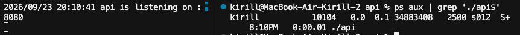
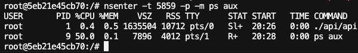
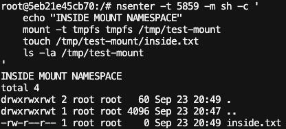
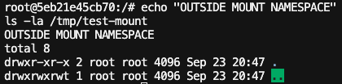
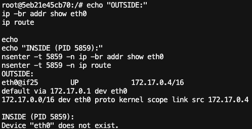
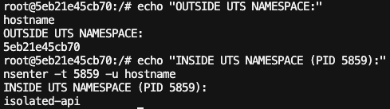
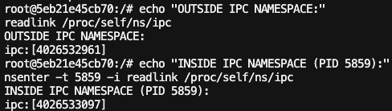
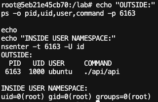

# Лабораторная работа 1 — Свой Docker

## Структура проекта

```text
lab1/
├── README.md
├── go.mod
├── mydocker.sh
├── images/
└── api/
    ├── main.go
    └── api
```

---

# Часть 0 — Свой сервис

В качестве тестового приложения используется HTTP-сервис `api`, написанный на Go.

### Эндпоинты

| Метод | Endpoint    | Назначение                            |
| ----- | ----------- | ------------------------------------- |
| GET   | `/health`   | Проверка доступности сервиса          |
| GET   | `/eat?mb=N` | Выделение и удержание `N` MB памяти   |
| GET   | `/burn`     | Бесконечная нагрузка на одно CPU-ядро |

---

# Часть 1 — Запуск напрямую

Сервис запущен непосредственно на хостовой системе без дополнительной изоляции.



PID процесса: `10104`.

Проверка endpoint `/health`:


Сервис успешно отвечает на HTTP-запросы.

---

# Часть 2 — Namespaces

Для изоляции процесса создаются следующие Linux namespaces:

| Namespace | Что изолируется                        |
| --------- | -------------------------------------- |
| PID       | Пространство идентификаторов процессов |
| Mount     | Точки монтирования                     |
| Network   | Сетевые интерфейсы и маршруты          |
| UTS       | Hostname                               |
| IPC       | IPC-механизмы                          |
| User      | Идентификаторы пользователей и группы  |

Запуск выполняется через `unshare`.

## PID namespace

API получает PID `1` внутри собственного PID namespace.
Процессы внешнего namespace внутри него не отображаются.



**Результат:** PID namespace изолирован. ✅

---

## Mount namespace

Внутри Mount namespace был создан отдельный `tmpfs` и файл `inside.txt`.
Файл существует внутри namespace, но не виден во внешнем namespace.





**Результат:** Mount namespace изолирован. ✅

---

## Network namespace

Внешний namespace имеет сетевой интерфейс `eth0` и маршруты.
В Network namespace процесса интерфейс `eth0` отсутствует.



**Результат:** Network namespace изолирован. ✅

---

## UTS namespace

Процесс внутри UTS namespace получает собственное имя хоста `isolated-api`,
отличное от hostname внешнего namespace.



**Результат:** UTS namespace изолирован. ✅

---

## IPC namespace

Процесс находится в отдельном IPC namespace.
Идентификаторы IPC namespace внутри и снаружи различаются.



**Результат:** IPC namespace изолирован. ✅

---

## User namespace

Процесс API снаружи работает от непривилегированного пользователя
`ubuntu` с UID `1000`, а внутри User namespace имеет UID `0` (`root`).



**Результат:** User namespace изолирован: UID `0` внутри namespace
соответствует UID `1000` (`ubuntu`) во внешнем namespace. ✅

---

## Результат части 2

Изолированы все требуемые namespaces:

* ✅ PID namespace
* ✅ Mount namespace
* ✅ Network namespace
* ✅ UTS namespace
* ✅ IPC namespace
* ✅ User namespace
