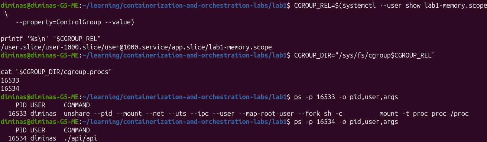
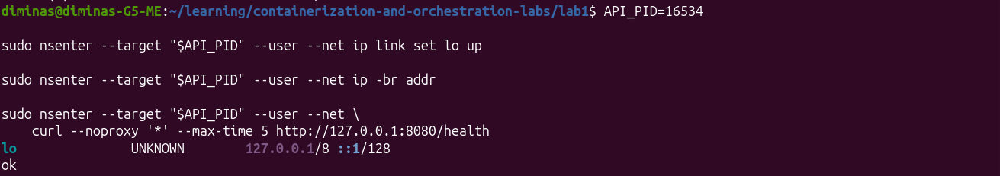
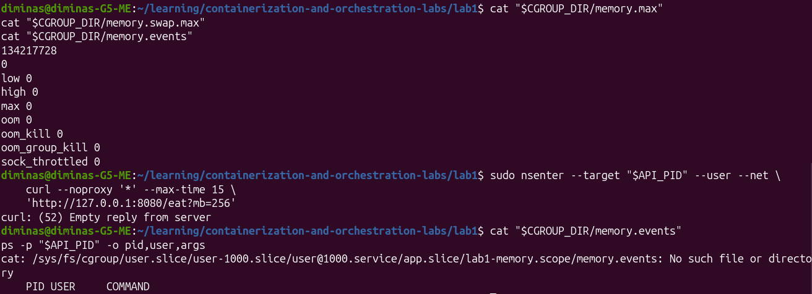
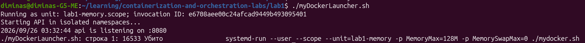
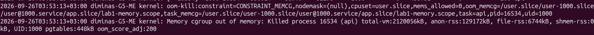
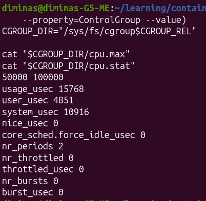
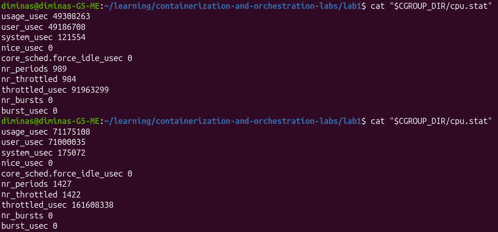
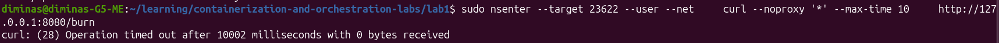

# Лабораторная работа 1 — Свой Docker

## Структура проекта

```text
lab1/
├── README.md
├── go.mod
├── mydocker.sh
├── images/
└── api/
    ├── main.go
    └── api
```

---

# Часть 0 — Свой сервис

В качестве тестового приложения используется HTTP-сервис `api`, написанный на Go.

### Эндпоинты

| Метод | Endpoint    | Назначение                            |
| ----- | ----------- | ------------------------------------- |
| GET   | `/health`   | Проверка доступности сервиса          |
| GET   | `/eat?mb=N` | Выделение и удержание `N` MB памяти   |
| GET   | `/burn`     | Бесконечная нагрузка на одно CPU-ядро |

---

# Часть 1 — Запуск напрямую

Сервис запущен непосредственно на хостовой системе без дополнительной изоляции.


PID процесса: `10104`.

Проверка endpoint `/health`:


Сервис успешно отвечает на HTTP-запросы.

---

# Часть 2 — Namespaces

Для изоляции процесса создаются следующие Linux namespaces:

| Namespace | Что изолируется                        |
| --------- | -------------------------------------- |
| PID       | Пространство идентификаторов процессов |
| Mount     | Точки монтирования                     |
| Network   | Сетевые интерфейсы и маршруты          |
| UTS       | Hostname                               |
| IPC       | IPC-механизмы                          |
| User      | Идентификаторы пользователей и группы  |

Запуск выполняется через `unshare`.

## Особенности запуска на Ubuntu: AppArmor

При попытке запуска на Ubuntu запуск `./mydocker.sh` от обычного
пользователя завершился ошибкой до запуска API:

```text
unshare: write failed /proc/self/uid_map: Операция не позволена
```

Ошибка воспроизвелась и на минимальной команде, тогда я понял, что такое настоящий конфуз:

```bash
unshare --user --map-root-user id
```

По совету чата гпт для диагностики были проверены журнал ядра и настройка ограничения:

```bash
sudo journalctl -k --since "1 minute ago" --no-pager |
    grep -E 'comm="unshare"'
sysctl kernel.apparmor_restrict_unprivileged_userns
```

В журнале AppArmor зафиксировал перевод `unshare` в профиль
`unprivileged_userns` и отказ в использовании capability `CAP_SYS_ADMIN`:

```text
apparmor="AUDIT" operation="userns_create" ... target="unprivileged_userns"
apparmor="DENIED" operation="capable" ... profile="unprivileged_userns" ... capname="sys_admin"
```

Значение `kernel.apparmor_restrict_unprivileged_userns = 1` подтвердило,
что ограничение включено. Таким образом, запуск блокировала политика
AppArmor, а не код сервиса.

### Настройка разрешения для учебного скрипта

Для разрешения User namespaces выбран отдельный профиль AppArmor,
привязанный к пути скрипта. Содержимое файла
`/etc/apparmor.d/lab1-mydocker`:

```text
abi <abi/4.0>,
include <tunables/global>

profile lab1-mydocker /home/diminas/learning/containerization-and-orchestration-labs/lab1/mydocker.sh flags=(default_allow) {
    userns,
}
```

При воспроизведении на другой машине абсолютный путь нужно заменить на
фактический путь к `mydocker.sh`. Режим `default_allow` разрешающий;
правило `userns,` явно разрешает User namespaces.

Загрузка профиля выполняется с административными правами:

```bash
sudo apparmor_parser -r /etc/apparmor.d/lab1-mydocker
```

Затем из каталога `lab1` скрипт запускается непосредственно, от обычного
пользователя:

```bash
./mydocker.sh
```

В итоге запустить удалось.

## PID namespace

API получает PID `1` внутри собственного PID namespace.
Процессы внешнего namespace внутри него не отображаются.


**Результат:** PID namespace изолирован. ✅

---

## Mount namespace

Внутри Mount namespace был создан отдельный `tmpfs` и файл `inside.txt`.
Файл существует внутри namespace, но не виден во внешнем namespace.


**Результат:** Mount namespace изолирован. ✅

---

## Network namespace

Внешний namespace имеет сетевой интерфейс `eth0` и маршруты.
В Network namespace процесса интерфейс `eth0` отсутствует.


**Результат:** Network namespace изолирован. ✅

---

## UTS namespace

Процесс внутри UTS namespace получает собственное имя хоста `isolated-api`,
отличное от hostname внешнего namespace.


**Результат:** UTS namespace изолирован. ✅

---

## IPC namespace

Процесс находится в отдельном IPC namespace.
Идентификаторы IPC namespace внутри и снаружи различаются.


**Результат:** IPC namespace изолирован. ✅

---

## User namespace

Процесс API снаружи работает от непривилегированного пользователя
`ubuntu` с UID `1000`, а внутри User namespace имеет UID `0` (`root`).


**Результат:** User namespace изолирован: UID `0` внутри namespace
соответствует UID `1000` (`ubuntu`) во внешнем namespace. ✅

---

## Результат части 2

Изолированы все требуемые namespaces:

* ✅ PID namespace
* ✅ Mount namespace
* ✅ Network namespace
* ✅ UTS namespace
* ✅ IPC namespace
* ✅ User namespace

# Часть 3

Сначала был запущен контейнер с помощью 

```bash
./myDockerLaunher.sh
```

Дальше был вычислен процесс, к которому стоит делать запросы.


И настроен его сетевой интерфейс для доступа.


# Память
Сначала была проведена проверка состояния счётчиков. Сразу после этого отправлен запрос на создание 256 байт, но, к сожалению, сервис даже не успел ответить, как был снят. Но пришло уведомление от Linux в консоль запуска лаунчером.

Случился OOM Kill







# CPU

Далее в лаунчер добавляем -p CPUQuota=50%.

При выполнении команды burn ответ не приходит, однако контейнер остаётся жив и приложение в нём не падает. Оно просто потребляет столько ресурсов, сколько ему было выделено.







