# Лабораторная работа 1 — Свой Docker

## Структура проекта

```text
lab1/
├── README.md
├── go.mod
├── mydocker.sh
├── images/
└── api/
    ├── main.go
    └── api
```

---

# Часть 0 — Свой сервис

В качестве тестового приложения используется HTTP-сервис `api`, написанный на Go.

### Эндпоинты

| Метод | Endpoint    | Назначение                            |
| ----- | ----------- | ------------------------------------- |
| GET   | `/health`   | Проверка доступности сервиса          |
| GET   | `/eat?mb=N` | Выделение и удержание `N` MB памяти   |
| GET   | `/burn`     | Бесконечная нагрузка на одно CPU-ядро |

---

# Часть 1 — Запуск напрямую

Сервис запущен непосредственно на хостовой системе без дополнительной изоляции.

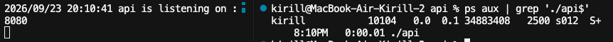

PID процесса: `10104`.

Проверка endpoint `/health`:


Сервис успешно отвечает на HTTP-запросы.

---

# Часть 2 — Namespaces

Для изоляции процесса создаются следующие Linux namespaces:

| Namespace | Что изолируется                        |
| --------- | -------------------------------------- |
| PID       | Пространство идентификаторов процессов |
| Mount     | Точки монтирования                     |
| Network   | Сетевые интерфейсы и маршруты          |
| UTS       | Hostname                               |
| IPC       | IPC-механизмы                          |
| User      | Идентификаторы пользователей и группы  |

Запуск выполняется через `unshare`.

## Особенности запуска на Ubuntu: AppArmor

При попытке запуска на Ubuntu запуск `./mydocker.sh` от обычного
пользователя завершился ошибкой до запуска API:

```text
unshare: write failed /proc/self/uid_map: Операция не позволена
```

Ошибка воспроизвелась и на минимальной команде, тогда я понял, что такое настоящий конфуз:

```bash
unshare --user --map-root-user id
```

По совету чата гпт для диагностики были проверены журнал ядра и настройка ограничения:

```bash
sudo journalctl -k --since "1 minute ago" --no-pager |
    grep -E 'comm="unshare"'
sysctl kernel.apparmor_restrict_unprivileged_userns
```

В журнале AppArmor зафиксировал перевод `unshare` в профиль
`unprivileged_userns` и отказ в использовании capability `CAP_SYS_ADMIN`:

```text
apparmor="AUDIT" operation="userns_create" ... target="unprivileged_userns"
apparmor="DENIED" operation="capable" ... profile="unprivileged_userns" ... capname="sys_admin"
```

Значение `kernel.apparmor_restrict_unprivileged_userns = 1` подтвердило,
что ограничение включено. Таким образом, запуск блокировала политика
AppArmor, а не код сервиса.

### Настройка разрешения для учебного скрипта

Для разрешения User namespaces выбран отдельный профиль AppArmor,
привязанный к пути скрипта. Содержимое файла
`/etc/apparmor.d/lab1-mydocker`:

```text
abi <abi/4.0>,
include <tunables/global>

profile lab1-mydocker /home/diminas/learning/containerization-and-orchestration-labs/lab1/mydocker.sh flags=(default_allow) {
    userns,
}
```

При воспроизведении на другой машине абсолютный путь нужно заменить на
фактический путь к `mydocker.sh`. Режим `default_allow` разрешающий;
правило `userns,` явно разрешает User namespaces.

Загрузка профиля выполняется с административными правами:

```bash
sudo apparmor_parser -r /etc/apparmor.d/lab1-mydocker
```

Затем из каталога `lab1` скрипт запускается непосредственно, от обычного
пользователя:

```bash
./mydocker.sh
```

В итоге запустить удалось.

## PID namespace

API получает PID `1` внутри собственного PID namespace.
Процессы внешнего namespace внутри него не отображаются.

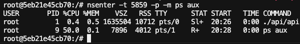

**Результат:** PID namespace изолирован. ✅

---

## Mount namespace

Внутри Mount namespace был создан отдельный `tmpfs` и файл `inside.txt`.
Файл существует внутри namespace, но не виден во внешнем namespace.

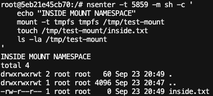

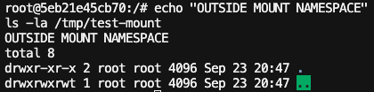

**Результат:** Mount namespace изолирован. ✅

---

## Network namespace

Внешний namespace имеет сетевой интерфейс `eth0` и маршруты.
В Network namespace процесса интерфейс `eth0` отсутствует.

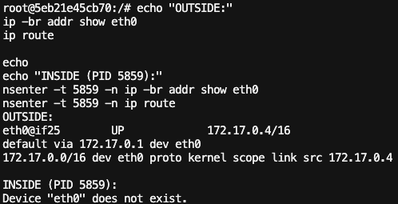

**Результат:** Network namespace изолирован. ✅

---

## UTS namespace

Процесс внутри UTS namespace получает собственное имя хоста `isolated-api`,
отличное от hostname внешнего namespace.

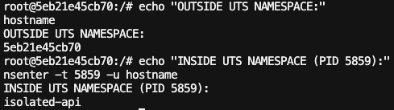

**Результат:** UTS namespace изолирован. ✅

---

## IPC namespace

Процесс находится в отдельном IPC namespace.
Идентификаторы IPC namespace внутри и снаружи различаются.

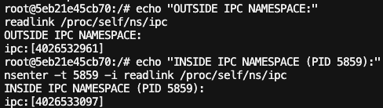

**Результат:** IPC namespace изолирован. ✅

---

## User namespace

Процесс API снаружи работает от непривилегированного пользователя
`ubuntu` с UID `1000`, а внутри User namespace имеет UID `0` (`root`).

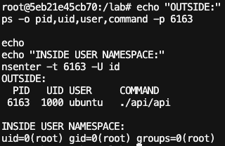

**Результат:** User namespace изолирован: UID `0` внутри namespace
соответствует UID `1000` (`ubuntu`) во внешнем namespace. ✅

---

## Результат части 2

Изолированы все требуемые namespaces:

* ✅ PID namespace
* ✅ Mount namespace
* ✅ Network namespace
* ✅ UTS namespace
* ✅ IPC namespace
* ✅ User namespace

# Часть 3 — cgroups

Проверена поддержка cgroup v2: иерархия смонтирована в `/sys/fs/cgroup`, контроллеры `memory`, `cpu` и `pids` доступны. Namespaces определяют, что процесс видит, а теперь нужно ограничить, сколько ресурсов он может съесть.

На момент опытов `./myDockerLauncher.sh` через `systemd-run --user --scope` создавал группу `lab1-memory.scope` и запускал в ней API. Потом это всё дело было перенесено в сам `mydocker.sh`, так что сейчас запуск собран в одном файле.

Дальше был вычислен процесс, к которому стоит делать запросы (это происходит каждый раз после перезапуска). Через `cgroup.procs` и `ps` нашлись `unshare` с PID `16533` и API с PID `16534`.

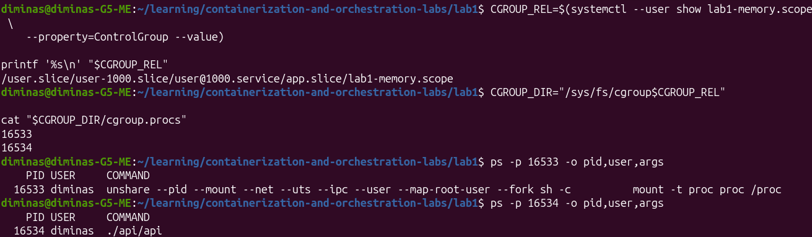

В сети API включён `lo`, а запрос через `nsenter --user --net` вернул `ok`. Внешний `localhost` — вообще другой `localhost`, поэтому запрос делается именно из сетевого namespace API.

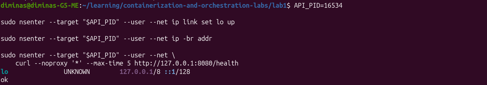

## Память

Установлены `MemoryMax=128M` и `MemorySwapMax=0`: 128 МиБ на всю группу, swap запрещён. В `memory.max` получили `134217728`, исходные `oom` и `oom_kill` — нули.

После запроса `/eat?mb=256` на выделение **256 МиБ** сервис даже не успел ответить, как был снят. Случился OOM Kill.

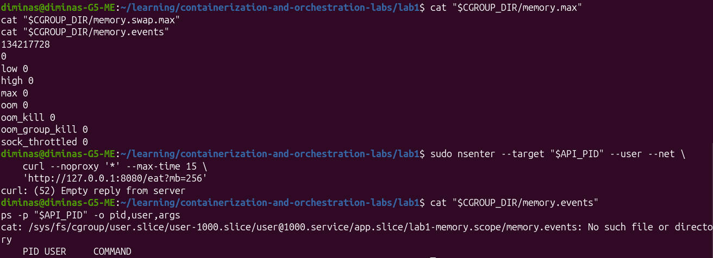

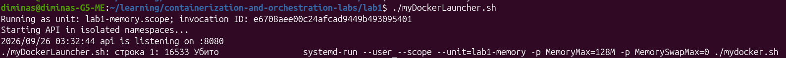

Сам по себе `Empty reply from server` ещё ничего не доказывает. Но ничего страшного, ведь заранее был включён журнал ядра. В нём написано черным по белому:

- `CONSTRAINT_MEMCG` и `oom_memcg=.../lab1-memory.scope` — причина в лимите нашей cgroup;
- `Memory cgroup out of memory: Killed process 16534 (api)` — ядро завершило API.

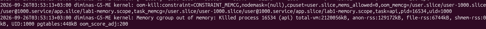

Systemd удалил опустевшую группу. Я пробовал несколько раз, но рост `oom_kill` после нагрузки снять не получилось: файл уже исчезал. Доказательством служит журнал ядра.

**Результат:** ограничение памяти сработало. Это механизм, который при превышении лимита памяти контейнера может приводить к `OOMKilled`.

## CPU

Далее добавляем `-p CPUQuota=50%`. В `cpu.max` получилось `50000 100000`: 50 мс CPU-времени на период 100 мс, то есть половина одного CPU.

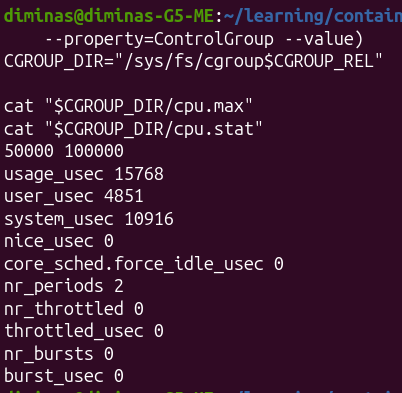

При запросе `/burn` ответ не приходит, однако приложение не падает. Таймаут `curl` связан с тем, что обработчик занят циклом и не отправляет ответ. После отключения клиента цикл продолжает крутиться.

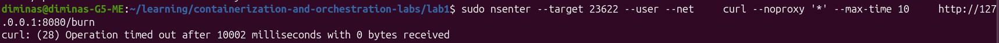

А вот `cpu.stat` уже доказывает throttling:

| Счётчик | До нагрузки | Первый замер под нагрузкой | Второй замер |
| --- | ---: | ---: | ---: |
| `nr_throttled` | 0 | 984 | 1422 |
| `throttled_usec` | 0 | 91 963 299 | 161 608 338 |

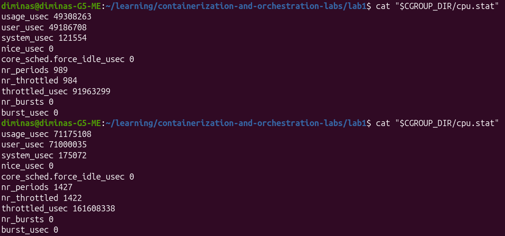

**Результат:** бюджет CPU регулярно заканчивался, и группа ждала следующего периода. В отличие от OOM, процесс не убивается, а получает меньше процессорного времени.

## Процессы

Для проверки количества задач выбран `TasksMax=20`, что дало `pids.max = 20`. Считаются **и процессы, и потоки ОС**, поэтому у `unshare` и многопоточного Go API до опыта было 6 задач.

Временная оболочка с PID `12030` перенесена в группу API записью PID в `cgroup.procs`. Принадлежность проверена через `/proc/self/cgroup`. Из неё запущен тест:

```bash
stress-ng --fork 1 --fork-max 40 --timeout 10s --metrics-brief
```

Дочерние процессы наследуют cgroup оболочки; её перенос не означает вход в namespaces API.

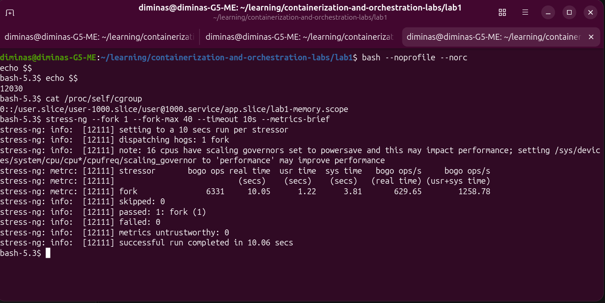

После теста `pids.events: max` вырос с `0` до **16675**, а `pids.current` составил `7`: нагрузка завершилась, но временный `bash` ещё работал. Счётчики OOM остались нулевыми.

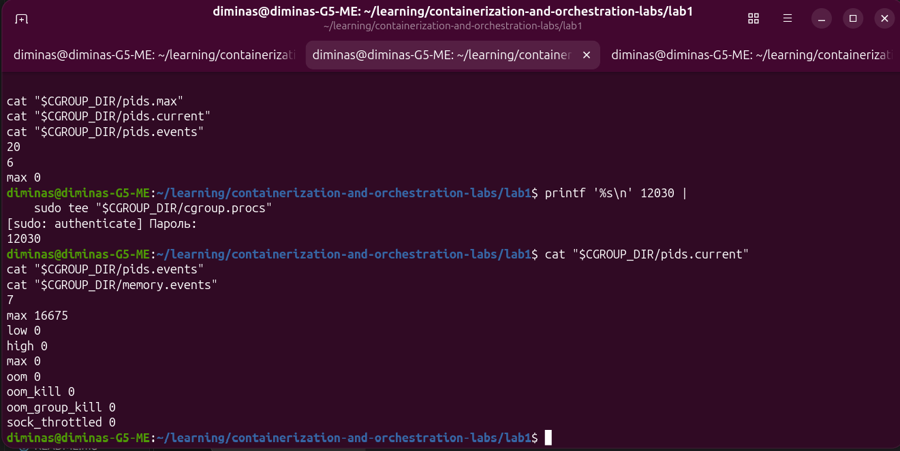

`max 16675` — число отказов в создании задач, а не число созданных или убитых процессов. `successful run` у stress-ng означает, что утилита обработала отказы и штатно закончила тест.

**Результат:** бесконтрольно расплодиться группе не дали.

## Итог

В `mydocker.sh` собран запуск через `systemd-run` со следующими ограничениями:

| Параметр | Значение | Что ограничивает |
| --- | --- | --- |
| `MemoryMax` | `128M` | Память всей группы |
| `MemorySwapMax` | `0` | Использование swap |
| `CPUQuota` | `50%` | CPU-время: половина одного CPU |
| `TasksMax` | `20` | Число процессов и потоков |

Все три пункта задания проверены: OOM через `/eat`, throttling через `/burn` и отказы через `stress-ng --fork`. Для остановки используется `systemctl --user stop lab1-memory.scope`, а `--collect` убирает юнит после завершения, включая ошибку.

# Часть 4 — Права

## Привилегии

Работа с привилегиями показана на примере сети. Через `capsh --decode` среди полномочий API нашлась `CAP_NET_ADMIN`. В тестовой оболочке внутри его User и Network namespaces команда `ip link set lo up` сначала отработала с `exit=0`.

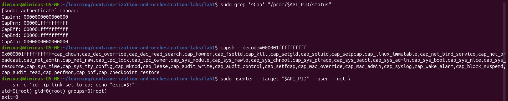

После запуска оболочки через `capsh --drop=cap_net_admin` та же операция вернула `Operation not permitted` и `exit=2`. При этом `id` всё ещё показывал `uid=0(root)`: одного имени root оказалось недостаточно.

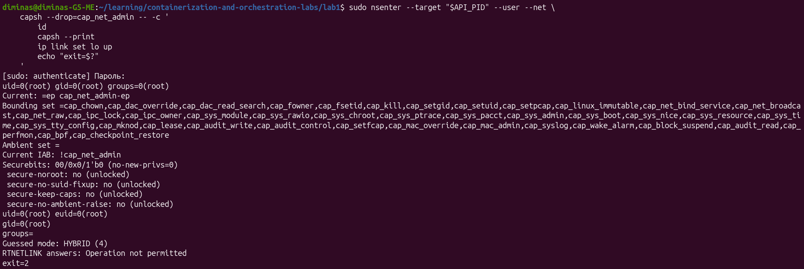

Сначала ограничивалась только **тестовая оболочка**. Новый вход через `sudo nsenter` без сброса capability снова позволял выполнить команду: полномочия принадлежат процессам, а не всему namespace сразу.

Затем ограничен сам API:

```bash
exec setpriv --bounding-set=-all --inh-caps=-all --ambient-caps=-all --no-new-privs ./api/api
```

Команда стоит после `mount` и `hostname`: подготовке окружения полномочия нужны, а нашему HTTP-сервису на порту 8080 — уже нет. `--no-new-privs` запрещает получение новых привилегий через последующий запуск программ.

В `/proc/$API_PID/status` все `Cap...` стали нулевыми, `NoNewPrivs` — `1`. При этом `/health` вернул `ok`.

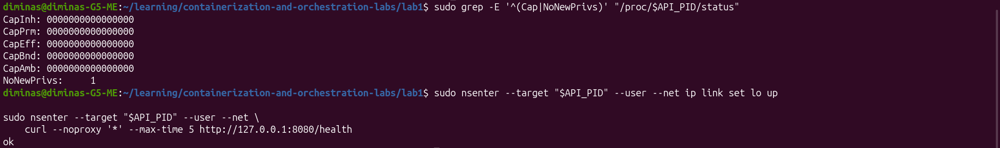

**Результат:** привилегированное действие без нужной capability отклоняется, а API работает без capabilities вообще. Настройка `lo` через отдельный `sudo nsenter` не возвращает полномочия самому API.

## seccomp-профиль

Вообще, чат гпт предложил сделать фильтр самостоятельно на C/C++, но так как уже существует утилита, которая буквально создана для этой задачи, была использована она. Это `enosys` из пакета `util-linux-extra`.

Из каталога `lab1` создаём фильтр:

```bash
enosys --syscall getppid:EPERM --dump > seccomp/seccomp.bpf
```

Запрещён `getppid` — получение PID родителя. Он должен возвращать ошибку `EPERM`, остальные вызовы разрешены.

Фильтр проверен с помощью Python:

```bash
setpriv --no-new-privs \
    python3 -c 'import os; print("getppid:", os.getppid())'

setpriv --no-new-privs --seccomp-filter=seccomp/seccomp.bpf \
    python3 -c 'import os; print("getppid:", os.getppid())'
```

Без фильтра получили `11609`, с фильтром — `-1`. Промежуточная ошибка на скриншоте связана с неверным путём; после исправления фильтр загрузился.

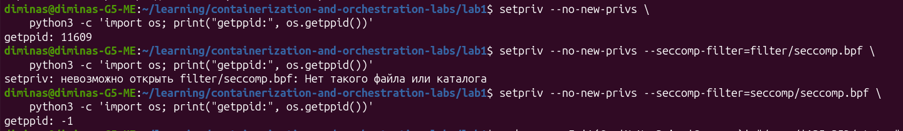

Далее в команду `setpriv` перед запуском API добавлен `--seccomp-filter=seccomp/seccomp.bpf`. После перезапуска у самого API:

- все `Cap...` — нули, `NoNewPrivs: 1`;
- `Seccomp: 2` — режим фильтрации, `Seccomp_filters: 1` — один фильтр;
- `/health` отвечает `ok`.

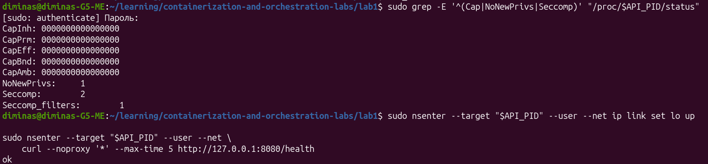

**Результат:** Python показал отказ конкретного вызова, а статус API — что фильтр применяется и к сервису, который продолжает работать.

Capabilities ограничивают привилегированные действия, seccomp — системные вызовы. Профиль здесь учебный: один запрет `getppid` демонстрирует механизм, но не является полноценной защитой API.

# Часть 5 — Собери свой Docker

Была проверена работоспособность самодельного докера.

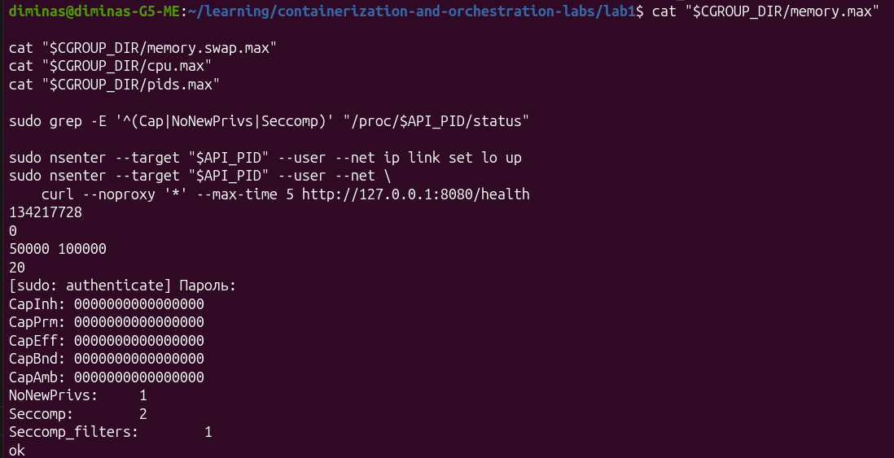

Для запуска оригинального Docker была исопльзована команда, которая позволит сделать работу приложения максимально приближенно к самодельному docker.

```bash
sudo docker run -d --name lab1-docker \
    --memory=128m \
    --memory-swap=128m \
    --cpus=0.5 \
    --pids-limit=20 \
    --cap-drop=ALL \
    --security-opt=no-new-privileges=true \
    --security-opt seccomp=./seccomp/seccompForDocker.json \
    -p 127.0.0.1:8080:8080 \
    lab1-api:local
```

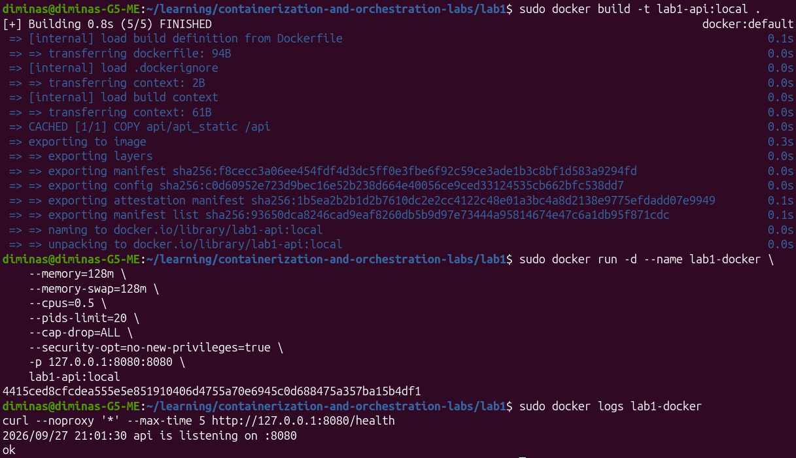

## Сравнение со своим скриптом

Оба варианта запускают наш Go-сервис, и в обоих случаях `/health` отвечает `ok`. Для образа на `scratch` пришлось собрать статический `api_static`: обычному бинарнику не хватало динамического загрузчика. Код приложения при этом тот же.

Лимиты в `docker run` заданы специально: сами по себе такие ограничения Docker не включает.

| Что сравниваем | Мой `mydocker.sh` | Запуск через Docker |
| --- | --- | --- |
| Изоляция процессов | `unshare` создаёт PID, Mount, Network, UTS, IPC и User namespaces | Docker организует namespaces через контейнерную среду запуска; User namespace требует отдельного внимания |
| Память | `MemoryMax=128M`, swap запрещён | `--memory=128m --memory-swap=128m`: тот же предел и отсутствие swap |
| CPU | `CPUQuota=50%` | `--cpus=0.5`: половина одного CPU |
| Задачи | `TasksMax=20` | `--pids-limit=20`: процессы и потоки |
| Capabilities | Все сброшены через `setpriv` | Все сброшены флагом `--cap-drop=ALL` |
| Получение новых привилегий | `--no-new-privs` | `--security-opt=no-new-privileges=true` |
| Seccomp | Учебный фильтр запрещает только `getppid` | Используется seccomp json для docker |
| Сеть | Отдельная сеть без подключения наружу; включаем `lo` и обращаемся через `nsenter` | Docker настраивает сеть и публикацию порта; `curl` с хоста сразу получает ответ |
| Файловая система | Отдельные монтирования, но корень файловой системы не заменён | Собственный корень из образа `scratch` с добавленным `/api` |
| Управление | Скрипт, фиксированное имя scope и команды systemd | Имена и ID контейнеров, `docker ps`, `logs`, `inspect`, `stop`, `rm` |

С памятью есть неочевидный момент: у Docker `--memory-swap` означает **память плюс swap**, поэтому равенство двух лимитов запрещает подкачку. Это соответствует нашему `MemorySwapMax=0`. [Описание лимитов Docker](https://docs.docker.com/engine/containers/resource_constraints/).

## Что Docker делает сверх скрипта

В моём варианте подготовка окружения пока во многом ручная: найти PID, включить интерфейс, зайти через `nsenter`. Docker уже умеет создавать bridge-сеть, подключать контейнер и публиковать порт.

Ещё у скрипта нет работы с образами, их слоями и отдельной корневой файловой системой.

Ну и Docker хранит состояние контейнера и собирает его вывод: не нужно каждый раз вручную вспоминать PID. В скрипте часть управления делает systemd, но собственной системы образов, сетей и томов от этого не появляется.

**Итог:** свой Docker получился в смысле запуска процесса с namespaces, лимитами и урезанными правами. Настоящий Docker использует те же механизмы ядра и добавляет готовую работу с окружением и жизненным циклом контейнера.

# Часть 6 — Образы

## Сборка и размеры

В [Dockerfile](Dockerfile) добавлены две стадии: `build` на базе `golang:1` компилирует API с `CGO_ENABLED=0`, а `runtime` на базе `scratch` забирает только готовый бинарник. Компилятор своё дело сделал, тащить его дальше незачем.

Из одного Dockerfile собраны два образа:

```bash
sudo docker build --target build -t lab1-api:full .
sudo docker build -t lab1-api:multi .
```

В первом остаются инструменты сборки и исходники, во втором — только приложение.

| Образ | Размер по `docker image inspect` | Слои |
| --- | ---: | ---: |
| `lab1-api:full` | 1 427 101 807 байт (≈1,43 ГБ) | 11 |
| `lab1-api:multi` | 13 522 004 байта (≈13,5 МБ) | 1 |

Образ похудел примерно в **106 раз**. Старый `lab1-api:local` тоже был на `scratch`, но бинарник для него собирался на хосте. Теперь вся сборка описана в Dockerfile.

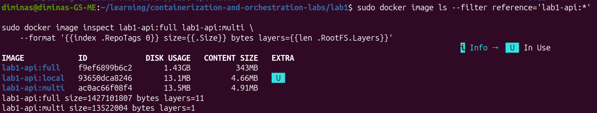

## Кэш

Повторная сборка без изменений:

```bash
sudo docker build --progress=plain -t lab1-api:multi .
```

`WORKDIR`, копирование `go.mod` и исходника, компиляция и копирование бинарника в финальную стадию получили `CACHED`. Заново компилировать то же самое Docker не стал.

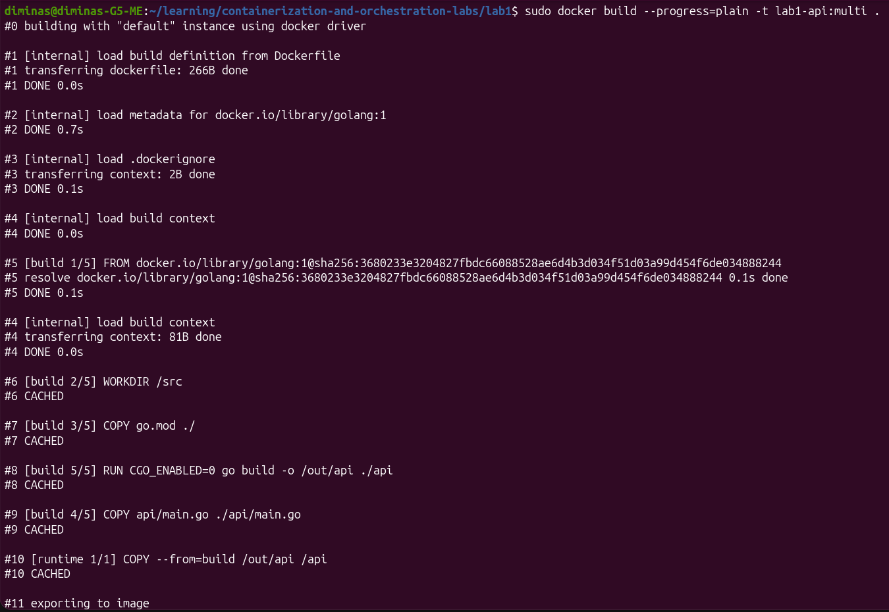

## Файл без тома и с томом

Для опыта использован `full`: там есть `sh` и `cat`, которых нет в `scratch`.

Сначала внутри контейнера создан `/data/test.txt` с текстом `hello from container`. Файл прочитался. После `docker stop`, `docker rm` и нового запуска из того же образа получили `No such file or directory`. Контейнер пересоздали, файл попрощался: он лежал в удалённом записываемом слое. Обычная остановка без удаления его бы сохранила.

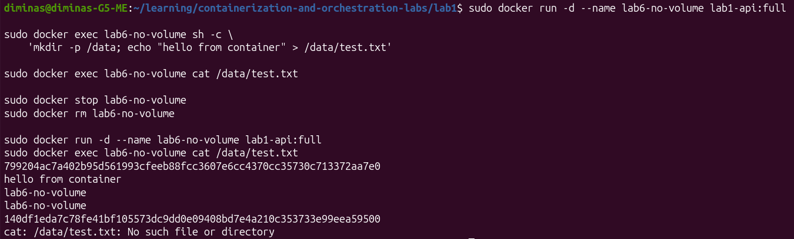

Затем создан том `lab6-data`, подключённый в `/data`:

```bash
--mount type=volume,source=lab6-data,target=/data
```

В файл записан текст `hello from volume`. Контейнер снова удалён и создан заново с тем же томом — файл на месте, текст читается.

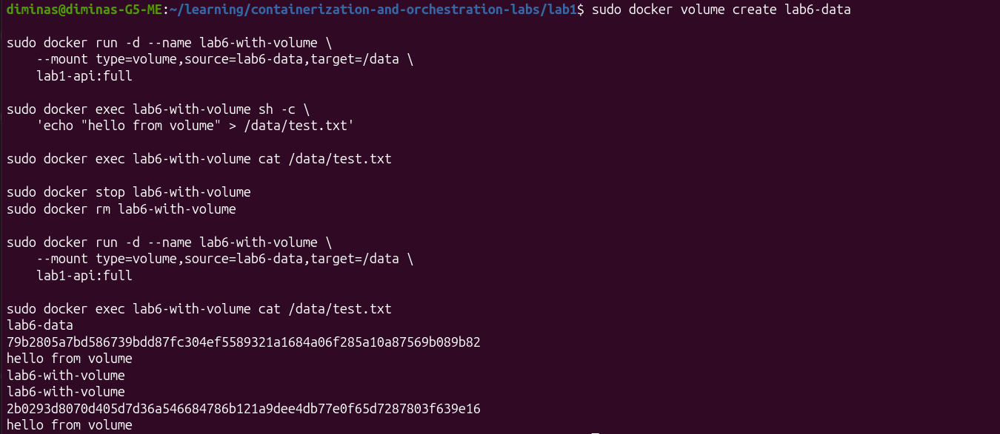

**Результат:** multi-stage убрал из финального образа инструменты сборки, кэш избавил от повторной компиляции, а том сохранил данные после удаления контейнера.
