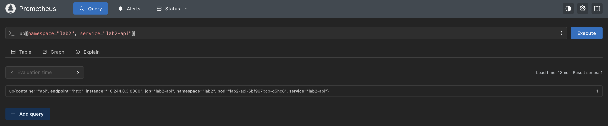
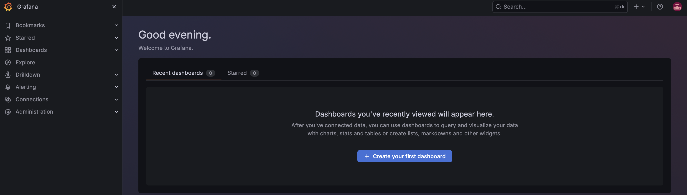
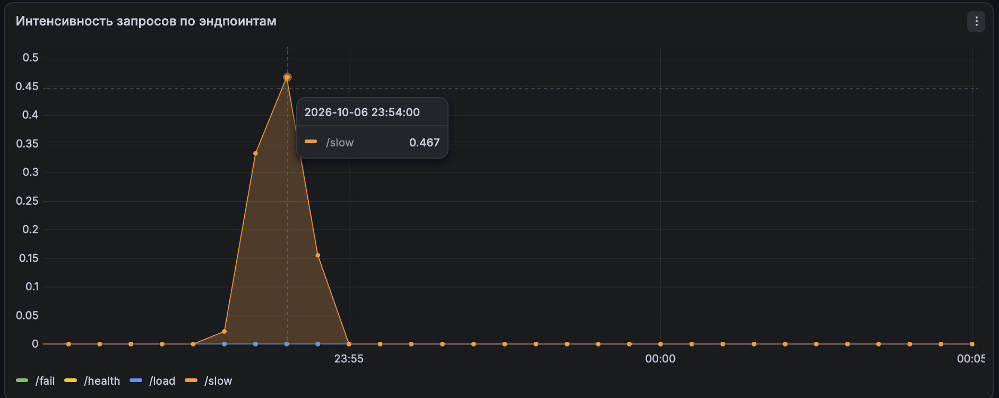
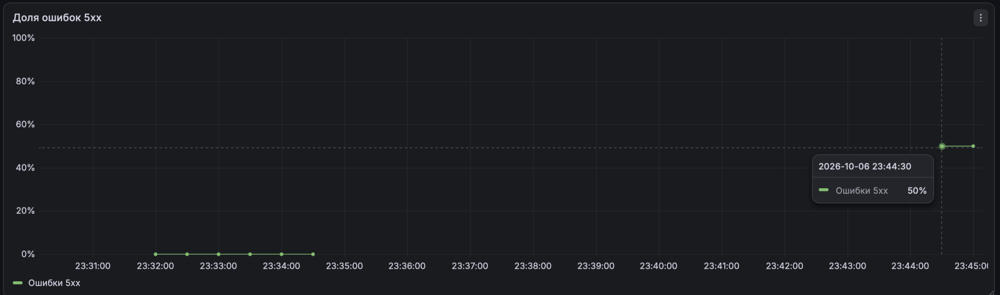
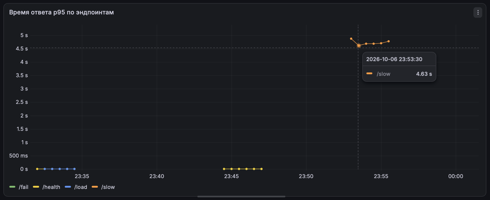
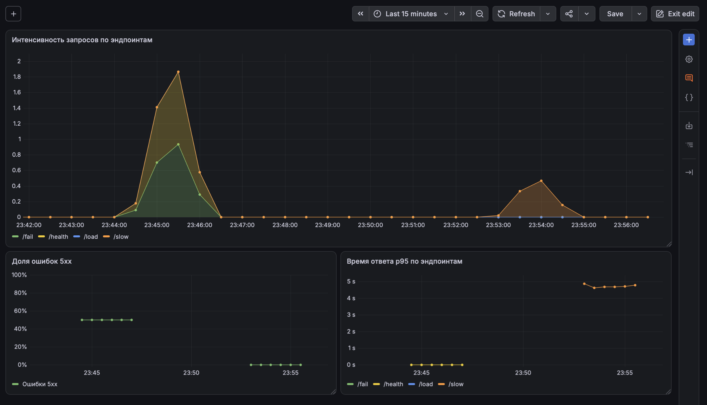

# Лабораторная работа 2 — Мониторинг сервиса: метрики, логи, трейсы

## Структура проекта

```text
lab2/
├── README.md
├── api/
│   ├── Dockerfile
│   ├── go.mod
│   ├── go.sum
│   ├── main.go
├── helm/
│   ├── monitoring-values.yaml
│   └── api/
│       ├── Chart.yaml
│       ├── values.yaml
│       ├── dashboards
│       │   └── red.json
│       └── templates
│           └── dashboard.yaml
│           └── deployment.yaml
│           └── monitoring.yaml
│           └── service.yaml
├── images/
│   ├── part1/
```

---

# Часть 0 — Свой сервис

В качестве тестового приложения используется HTTP-сервис `api`, написанный на Go.

### Эндпоинты

| Метод | Endpoint    | Назначение                            |
| ----- | ----------- | ------------------------------------- |
| GET   | `/health`   | Проверка доступности сервиса          |
| GET   | `/fail` | Вызов ошибки 5xx и увеличение счетчика ошибок  |
| GET   | `/slow`     | Медленный ответ (спит 1-3 секунды) |
| GET   | `/load`   | Запросы к себе для повышения RPS |
| GET   | `/metrics`   | Метрики для Prometheus |

### Метрики

| Метрика | Назначение |
| ----- | ----------- |
| `http_requests_total` | Накопленное число обработанных запросов |
| `http_errors_total` | Накопленное число ответов со статусом 5xx |
| `http_request_duration_seconds` | Распределение длительности запросов |

---

# Часть 1 — Метрики (Prometheus + Grafana)

Через Helm-чарт были установлены Prometheus, Grafana, Prometheus Operator и Alertmanager, все настройки были вынесены в отдельный файл `helm/monitoring-values.yaml`

```bash
helm upgrade --install monitoring prometheus-community/kube-prometheus-stack --values ./helm/monitoring-values.yaml
```

Для сбора метрик был обавлен объект ServiceMonitor, который необходим для подключения api к Prometheus. Его настройки лежат в файле `helm/api/templates/monitoring.yaml`


## Настройка доступов к Prometheus и Grafana

После запуска Prometheus стал доступен на 9090 порту. В качестве теста корректного подключения был выполнен запрос на проверку доступности lab2



Далее была запущена Grafana на 3000. В качестве источника данных конечно же использовался Prometheus




## Интенсивность запросов

Через визуальный редактор Builder была выбрана метрика `http_requests_total`, которая показывала накопленное число запросов. Затем была добавлена операция rate, которая рассчитывает среднее увеличение счетчика за 1 секунду.

Для проверки выполнялись повторные вызовы `/load`, каждый вазов создавал 20 дополнительных запросов к /health, и в результате на графике наблюдался рост интенсивности.




## Доля запросов 5хх

Следующий показатель рассчитывается как отношение интенсивности ошибочных запросов к интенсивности всех запросов в процентном соотношении `Percent (0-100)`. 

Проверка проводилась чередованием успешных и ошибочных запросов. При равном количестве успешных и ошибочных запросов показатель достиг примерно 50%




## Время ответа p95

Третья панель содержала в себе гистограмму длительности запросов. Разделение по адресам позволяет наблюдать задержки `/slow` независимо от большого числа быстрых запросов `/health`.

Для проверки выполнялись 30 последовательных вызовов, а на графике появилась линия `/slow` со значительно большим временем ответа, чем у быстрых обработчиков. Полученная оценка p95 составила около 4.75 секунды, хотя заданная задержка равна 1-3 секундам. Важно отметить, что такое расхождение связано с интервалами стандартной гистограммы, и запросы длительностью около 3х секунд попадают в интервал 2.5-5 секунд.




## Helm-конфигурация

Для удобного и быстрого развертывания в будущем, дашборд был экспортирован из Grafana в json и сохранен в проекте в файле `helm/api/dashboards/red.json`

А в Helm-чарт добавляется шаблон ConfigMap, который и содержит json дашборда. Так описание панелей хранится вместе с конфигурацией проекта и может быть повторно загружено в момент развертывания.

В результате получился во такой дашборд


